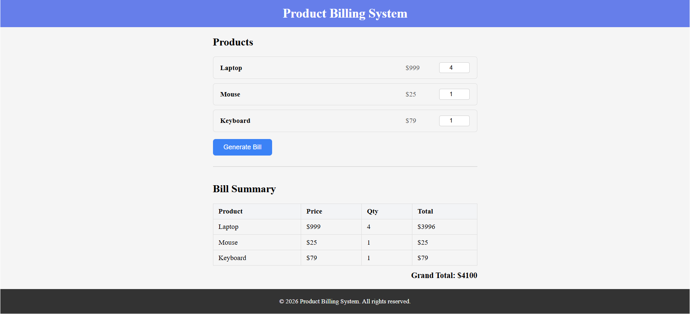

# Product Billing System

A simple Angular app built as a Day 4 learning exercise.

---


---

## Data Flow

```
User types quantity
       ↓
quantities[id] (plain object, two-way bound with [(ngModel)])
       ↓
User clicks "Generate Bill"
       ↓
generateBill() runs → reads quantities, calculates total per product
       ↓
billItems = signal<BillItem[]>  ← signal is updated with .set()
       ↓
Angular re-renders the Bill Summary table automatically
       ↓
grandTotal = computed() → sums all item totals from the signal
```

---

## Key Angular Concepts Used

| Concept | Where |
|---|---|
| `signal()` | stores the bill items list |
| `computed()` | calculates grand total from signal |
| `[(ngModel)]` | two-way binds the quantity input |
| `@for` | loops over products and bill items |
| `@if` | shows bill summary only when items exist |
| No DI / No Service | everything lives inside `ProductListComponent` |
